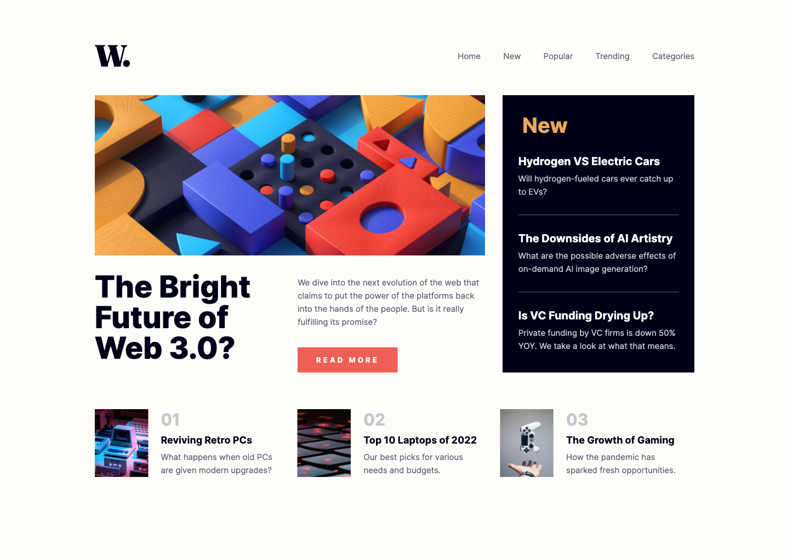
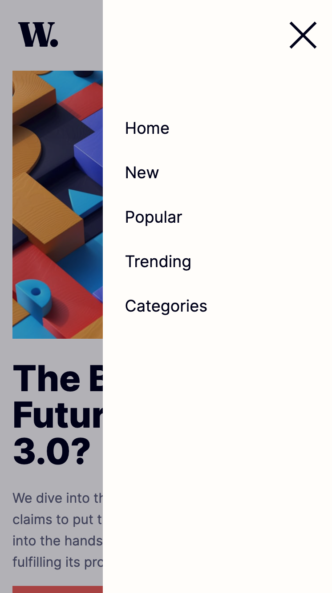

# Frontend Mentor - News homepage solution

This is a solution to the [News homepage challenge on Frontend Mentor](https://www.frontendmentor.io/challenges/news-homepage-H6SWTa1MFl). Frontend Mentor challenges help you improve your coding skills by building realistic projects. 

## Table of contents

- [Overview](#overview)
  - [The challenge](#the-challenge)
  - [Screenshot](#screenshot)
  - [Links](#links)
- [My process](#my-process)
  - [Built with](#built-with)
  - [What I learned](#what-i-learned)
  - [Continued development](#continued-development)
  - [Useful resources](#useful-resources)
- [Acknowledgments](#acknowledgments)

## Overview

### The challenge

Users should be able to:

- View the optimal layout for the interface depending on their device's screen size
- See hover and focus states for all interactive elements on the page

### Screenshot

### Links

- Solution URL: [Add solution URL here](https://your-solution-url.com)
- Live Site URL: [GitHub](https://brijax.github.io/News-homepage/)

## My process

I started with the mobile design, using HTML to divide the content into smaller parts to work on: the navigation bar and three content sections. I initially hid the mobile menu and close icon then worked my way through styling each section from the top down.

This was my first time using Grid in earnest, and for the mobile design, it felt quite straight forward—I used one main column and then used either Flexbox or Grid in each of the content sections as necessary.

When the mobile design styling was finished, I unhid the mobile menu and worked on the Javascript to open and close the menu.

I then moved on to the desktop design, where I faced most of my Grid challenges. I used a 2 x 2 grid for the main content and another grid to style the div containing the main image and related text, where I had to do quite a lot of fiddling to make it align with other parts of the page. If I were to do this challenge again, I would definitely use a 3 x 3 grid for the main content to try and reduce the extra styling I had to do.

### Built with

- HTML5 markup
- CSS custom properties
- Flexbox
- CSS Grid
- Mobile-first workflow
- Javascript

### What I learned

As obvious as it may be, planning ahead when using Grid is my biggest takeaway from this project. I feel I could have avoided a lot of the challenges I faced if I had planned better.

I also tripped myself up a couple of times with typos in my js file, so I've learned to be a bit more observant of what I'm writing!

### Continued development

I really enjoyed working with Grid, especially in conjunction with Flexbox. I've got a lot to learn on how to use these best so plan to practice more.

I'd also like to use more Javascript in future projects.

### Useful resources

- [CSS Tricks](https://css-tricks.com/snippets/css/complete-guide-grid/) - This was super helpful when using CSS Grid.

## Acknowledgments

Big thank you to Roan for encouraging me to take on this project and for the helpful advice! [Roan MacMillan GitHub](https://github.com/RoanMacmillan)

